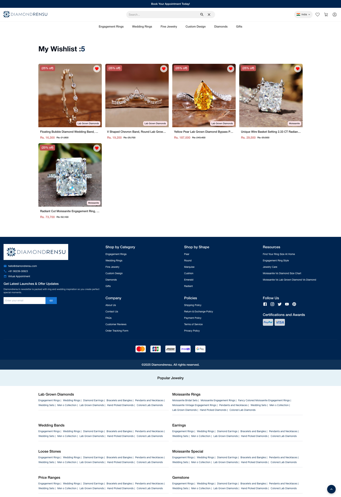

# 💍 Diamond Hub - Premium Jewelry E-Commerce Platform

**Project Name:** Diamond Hub (Jewelry Store)
**Live Application:** [https://diamong-hub.onrender.com](https://diamong-hub.onrender.com)
**Domain:** E-Commerce / Fashion & Luxury

---

## 📖 Executive Summary

**Diamond Hub** is a sophisticated e-commerce solution designed for the modern jewelry market. Specializing in **Lab-Grown Diamonds** and **Moissanite Jewelry**, the platform offers a seamless shopping experience for high-value items like engagement rings and wedding bands.

The website mimics the luxury of an in-store experience, allowing customers to customize their jewelry (size, metal, stone) and visualize it in high definition before purchasing.

---

## 🚀 Key Functional Modules

### 1️⃣ Customer Experience (Storefront)
* **Dynamic Catalog:** Users can browse collections by category (Engagement, Wedding, Fine Jewelry) or by stone shape (Pear, Radiant, Round).
* **Smart Wishlist:** A personalized "Favorites" section where users can save items to compare prices or buy later.
* **Customization Engine:** On the product page, customers can select their **Ring Size**, viewing real-time availability.
* **Trust Indicators:** Sections highlighting "Commitment to Excellence" and "Certified Quality" to build buyer confidence.

### 2️⃣ Operational Features (Backend)
* **Inventory Management:** Track stock levels for different ring sizes and metal types.
* **Order Processing:** Manage customer orders from "Placed" to "Shipped".
* **SEO Optimization:** Built with SEO-friendly structures to rank for keywords like "Lab Grown Diamond Rings".

---

## 📸 Visual Walkthrough & Workflow

### Phase 1: The Immersive Storefront
The Home Page is designed to inspire. It features a "Shop by Category" section and highlights "Best Sellers," guiding the user to popular products immediately.

*Figure 1: The elegant landing page featuring 'Shop by Category' and 'Lab-Grown Best Sellers'.*

### Phase 2: Detailed Product Customization
Buying jewelry is personal. The product page offers a comprehensive view with multiple angles, detailed descriptions, and a precise **Ring Size Selector**.

*Figure 2: Single product view (V-Shaped Chevron Band) showing image gallery, pricing, and size selection.*

### Phase 3: Wishlist & Shortlisting
Users often need time to decide. The Wishlist feature allows them to curate their favorite pieces (like the Radiant Cut Moissanite) in one place.

*Figure 3: The 'My Wishlist' section where users can track prices and availability of their saved items.*

---

## 💻 Technical Architecture

* **Frontend:** React.js (for a fast, single-page application experience).
* **Design Framework:** Custom CSS / Tailwind (for that premium, minimalist look).
* **Backend:** Node.js & Express.js (handling secure checkout logic).
* **Database:** MongoDB (storing complex product variants and user data).

---

## 🏁 Conclusion

**Diamond Hub** is not just a shop; it is a digital boutique. It successfully bridges the gap between traditional jewelry shopping and digital convenience, offering transparency, variety, and ease of use.

---
*Developed by: [Vrushabh Hirpara / JDK Solution]*
